# EVE市场姬

这是一个用于在QQ群里查询游戏《EVE Online》中市场中心（Jita）物价的Bot.

# 快速开始

## 准备工作

1. 一只QQ号
2. 宿主软件“酷Q”, 点这里下载[https://cqp.cc/t/23253](https://cqp.cc/t/23253) （可能需要登录才能看到页面）
3. 从[Release页面](https://github.com/yomunsam/EVEMarketBot/releases)下载或自行编译市场姬程序

## 启动和配置

首次下载“酷Q”,解压后如下

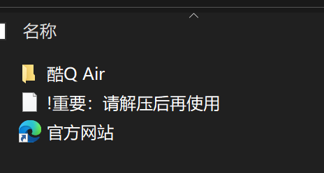

把从Release页面下载的市场姬主程序文件`io.nekonya.evemarket.bot.cpk`放置在"酷Q"的app目录下，

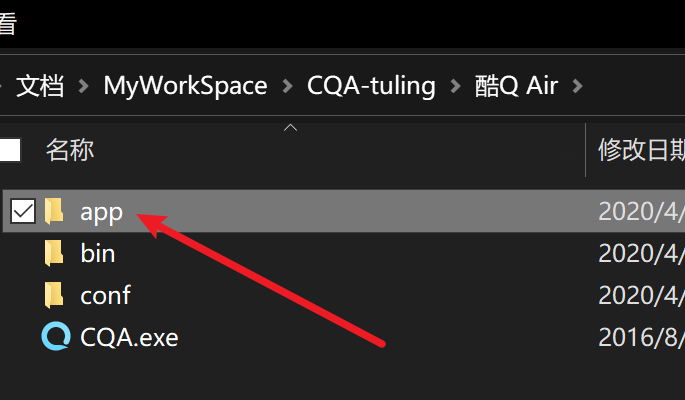

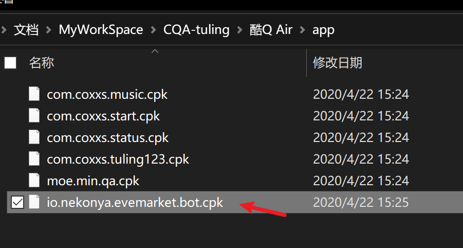

启动`CQA.exe`，登录QQ账号。

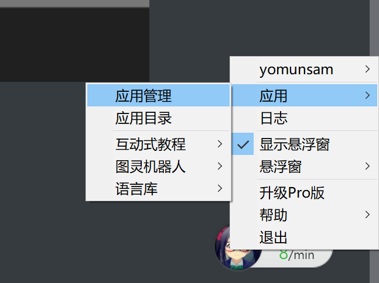

右键悬浮窗，找到“应用管理”菜单窗口。

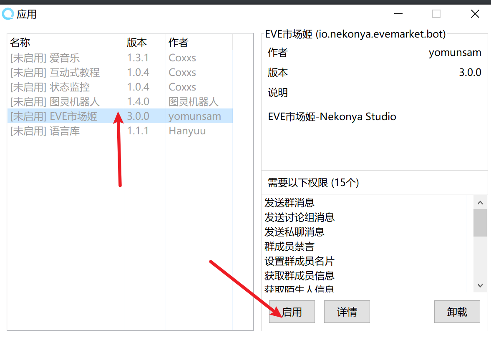

找到“EVE市场姬”，启用它。

找一个有该市场姬存在的QQ群，使用`.jita`命令随便查询一个什么东西：

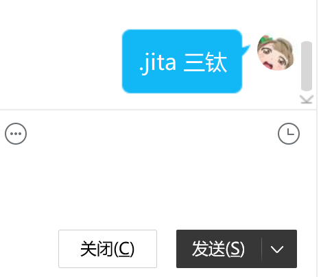

观察到报错如下：

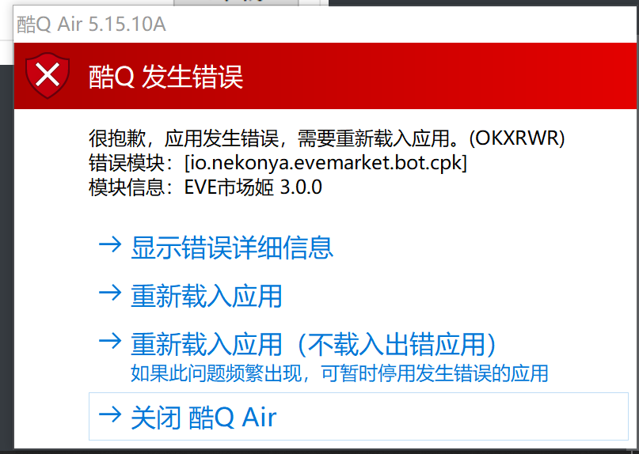

点击“重新载入应用程序”或者“关闭”。

接下来，我们观察到在酷Q的`data/app`目录下，有了市场姬的目录文件夹`io.nekonya.evemarket.bot`

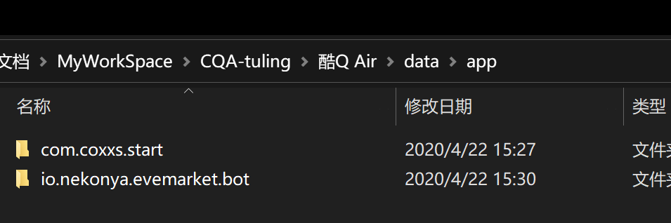

接下来，下载Relsase中的`eve_static.db`数据库文件，覆盖到上述的`io.nekonya.evemarket.bot`文件夹中。

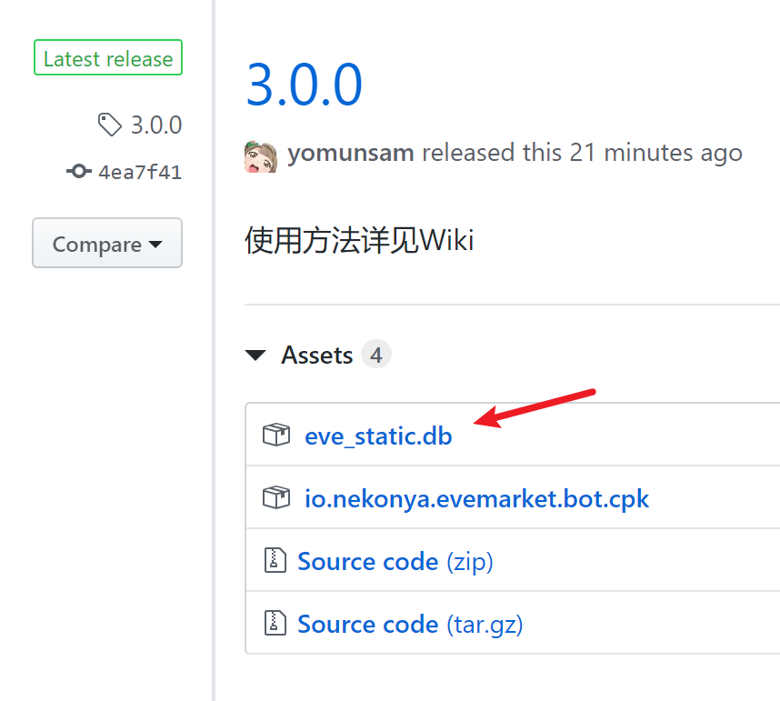

随后重启“酷Q”程序

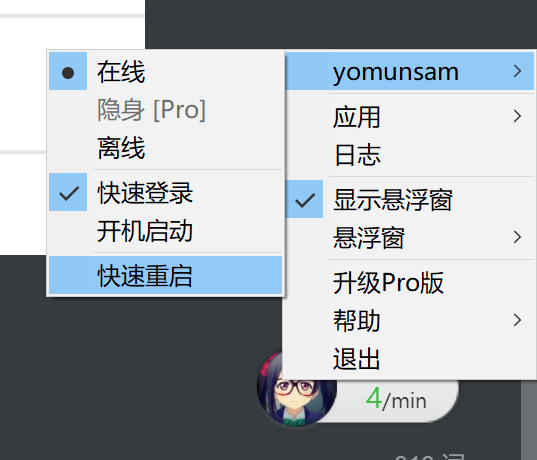

正常可用。


<br>

------

<br>

## 俗称绑定

通常，我们会对一些道具有些玩家间的俗称，如“三钛合金”通常被称为“三钛”，

但是直接搜索的话，是没有匹配项的。

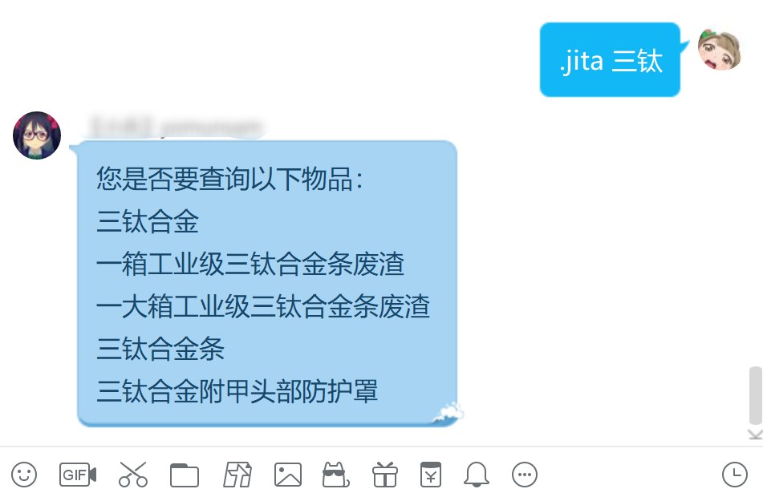

这时候，我们可以进行俗称绑定，把“三钛”这个词绑定给物品“三钛合金”。

俗称绑定的语法如下：

``` 
.bind 俗称,标准名称
```

（注意，俗称和标准名称之间使用**英文半角逗号**隔开。

但是，当我们直接操作的时候，会提示没有权限

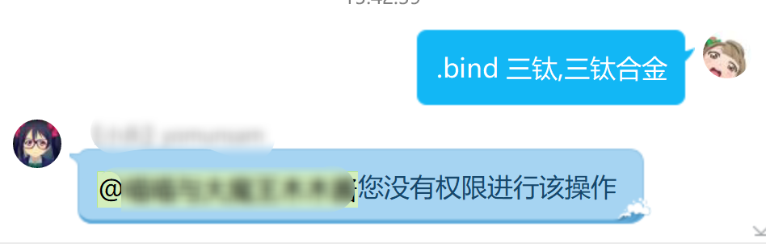


这是因为，俗称绑定是一个很敏感的功能，如果被滥用很容易影响正常的查询功能。

所以，我们给它设置了权限。


### 权限设置

在我们刚刚复制数据库的那个文件夹里（`data/app/io.nekonya.evemarket.bot`），有一个`config.json`的配置文件。

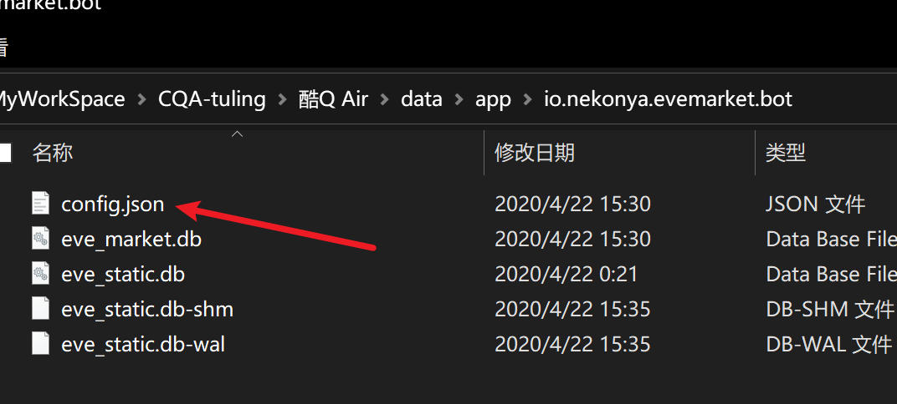

使用任意文本编辑器打开：


将“MasterQQ”的`0`,改成自己的QQ号，保存，然后重启酷Q.


### 管理员QQ

在配置文件中，`AdminQQ`是一个number类型的数组文件，添加在`AdminQQ`配置中的QQ号也有操作“俗称词库绑定”的权限。

**如果不知道Json的数组格式怎么写的话，千万不要动它**， 我们可以用MasterQQ指定的QQ号在QQ中设置管理员，如下：

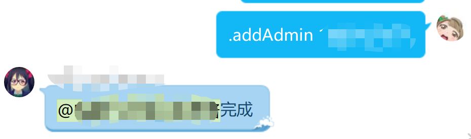

```
.addAdmin QQ号
```


设置完权限之后，我们就可以添加俗称绑定了。

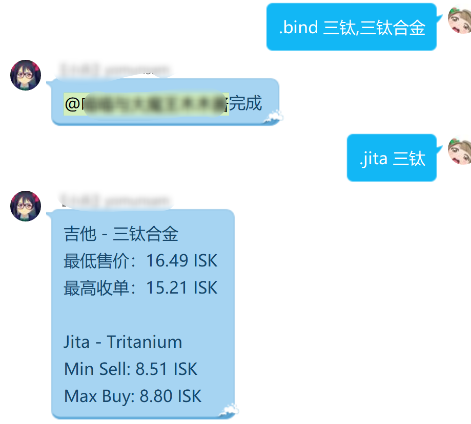


如果添加了不合适的俗称绑定，想要取消的话，可以使用`.unbind`命令来删除对应的绑定

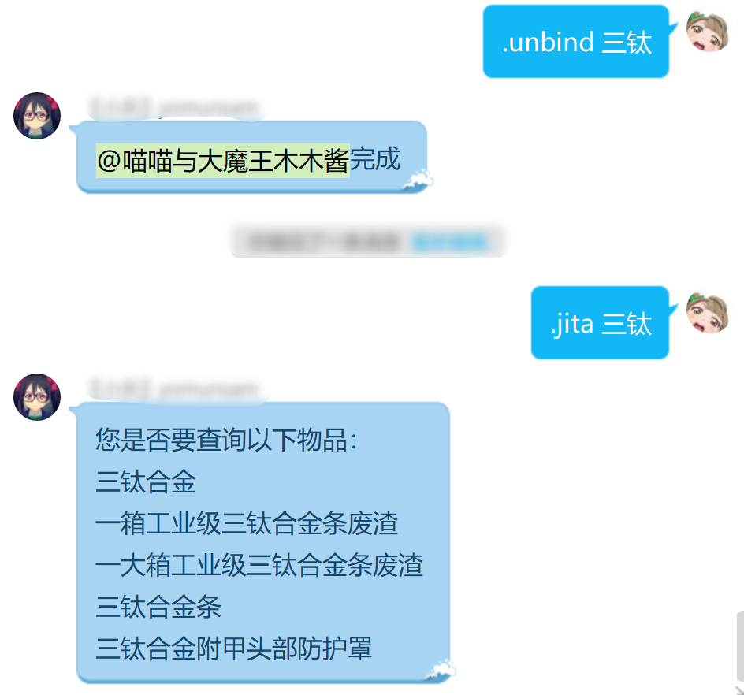

```
.unbind 俗称
```

